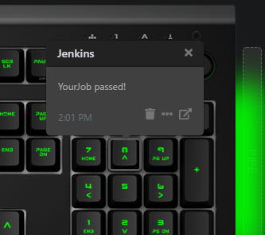

# Q Applet: Jenkins

A Das Keyboard applet to display the status of a job on Jenkins.

Jenkins is the leading open source automation server, Jenkins provides hundreds of plugins to support building, deploying and automating any project.

For more information checkout [jenkins.io](https://jenkins.io/).

## Changelog

[CHANGELOG.MD](CHANGELOG.md)

## Installation

Requires a Das Keyboard Q Series: www.daskeyboard.com.

Installation, configuration and uninstallation of applets is done within
the Q Desktop application (https://www.daskeyboard.com/q)

## Development Setup

You will need to install [Node](https://nodejs.org/) and [Yarn](https://yarnpkg.com/) to manage packages. This project also includes an [editorconfig](https://editorconfig.org/) file to aid in IDE setup. Also I use [ESLint](https://eslint.org/) for linting the source files. Open to tweaking the rules, just give me a shout.

## Running tests

- `yarn test`

## Contributions

Feel free to checkout the source code for the applet over at [GitHub](https://github.com/chrsmrtn-/daskeyboard-applet--jenkins). Pull requests welcome. 